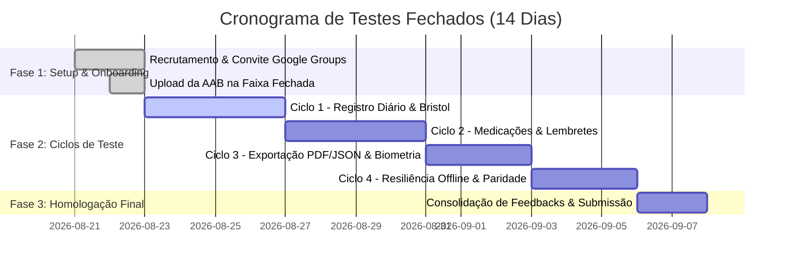

# 🧪 Plano de Testes Fechados & Homologação Google Play (20 Testadores / 14 Dias)
*Elaborado por @agent-qa — RCU Acompanhamento v1.0.0*

---

## 🎯 1. Objetivo & Requisito Google Play Console

Desde novembro de 2023, o Google Play exige que contas individuais de desenvolvedores realizem um **Teste Fechado (Closed Testing)** com pelo menos **20 testadores voluntários inscritos por um período mínimo de 14 dias ininterruptos** antes de liberar a publicação em Produção.

Este plano estabelece os procedimentos, matriz de testes e cronograma para garantir 100% de conformidade, estabilidade técnica e zero falhas clínicas.

---

## 📋 2. Cronograma de Testes Fechados (D-Day a D+14)

### 🗓️ Roteiro Diário dos Testadores (Checklist de Engajamento 14 Dias)

| Período | Foco Principal do Testador | Ações Obrigatórias |
| :--- | :--- | :--- |
| **Dia 1 - 3** | **Instalação & Primeiro Registro** | Baixar o app via Play Store (link fechado), conceder permissões biométricas, registrar a primeira evacuação com Escala de Bristol e sintomas basais. |
| **Dia 4 - 7** | **Adesão e Uso Contínuo** | Registrar pelo menos 2 entradas diárias (incluindo teste de "Falsa Saída/Gases" e "Acúmulo Matinal"), cadastrar 1 medicamento diário e marcar tomada de dose. |
| **Dia 8 - 10** | **Exportação e Relatório Clínico** | Acessar o Histórico, gerar relatório médico em PDF, visualizar o cálculo do Escore de Mayo e compartilhar o PDF via WhatsApp/Drive. |
| **Dia 11 - 12** | **Segurança & Modo Offline** | Ativar bloqueio biométrico, colocar o celular em Modo Avião (100% offline), fechar/abrir o app, verificar se tudo funciona instantaneamente sem travar. |
| **Dia 13 - 14** | **Backup & Finalização** | Realizar a exportação completa de dados em JSON (`Ajustes > Exportar Dados`) e responder ao Formulário Final de Satisfação. |

---

## 🔍 3. Matriz de Casos de Teste (QA Pre-Submission Checklist)

### 🏥 A. Protocolo Clínico & Cálculos
- [x] **TC-CLI-01:** Registro de evacuação com Fezes Formadas (Bristol 3-4) calcula pontuação de Mayo 0.
- [x] **TC-CLI-02:** Registro de fezes líquidas com sangue visível atualiza cálculo de Mayo Score e alerta de gravidade.
- [x] **TC-CLI-03:** "Falsa Saída (apenas gases/muco)" é computada separadamente sem inflar indevidamente a média de consistência fecal.
- [x] **TC-CLI-04:** Geração de PDF compila corretamente todas as médias e observações clínicas sem quebras de layout.

### 🔒 B. Segurança, LGPD & Resiliência
- [x] **TC-SEC-01:** App funciona 100% offline (Modo Avião ativado) — sem erros de rede no console.
- [x] **TC-SEC-02:** Bloqueio biométrico bloqueia a tela ao alternar apps ou suspender a tela.
- [x] **TC-SEC-03:** Privacy Shield oculta conteúdo sensível no switcher de aplicativos do Android.
- [x] **TC-SEC-04:** Exportação JSON gera payload estruturado com todos os registros e medicamentos.
- [x] **TC-SEC-05:** "Apagar Todos os Dados" remove todas as tabelas SQLite e reinicia o estado sem corromper o app.

### 🌍 C. Auditoria de Internacionalização (i18n)
- [x] **TC-I18N-01:** Alternância em tempo real entre Português e Inglês sem reiniciar o app.
- [x] **TC-I18N-02:** Verificação de paridade total nas chaves JSON de `src/locales/pt-BR` e `src/locales/en-US`.
- [x] **TC-I18N-03:** Zero strings clínicas ou termos da interface hardcoded sem função `t()`.

---

## 👥 4. Estrutura de Gestão dos 20 Testadores no Google Play Console

1. **Criação do Google Group para Testadores**:
   * E-mail do grupo: `rcu-acompanhamento-testers@googlegroups.com`
   * Adicionar os 20 e-mails cadastrados dos voluntários.
2. **Configuração da Faixa no Play Console**:
   * Aba: *Versão > Teste > Teste Fechado*.
   * Criar faixa: `Closed Testing - Alpha`.
   * Vincular a lista de e-mails do Google Group.
3. **Coleta de Feedback**:
   * Canal direto no Google Play (Comentários privados de teste).
   * Formulário Google Forms de Feedback com 4 perguntas simples de UX.
